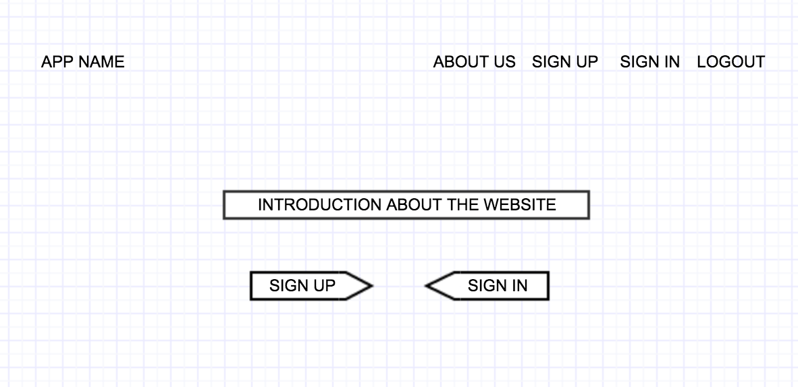
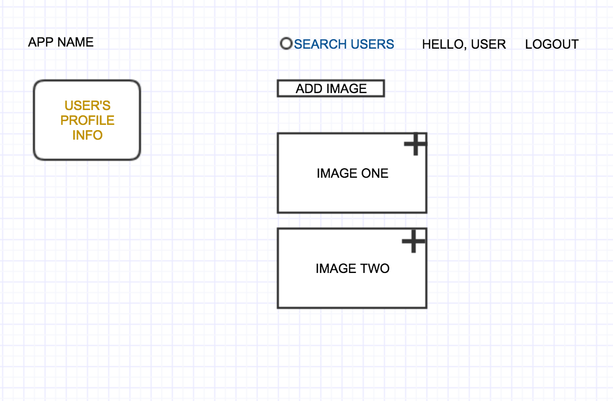
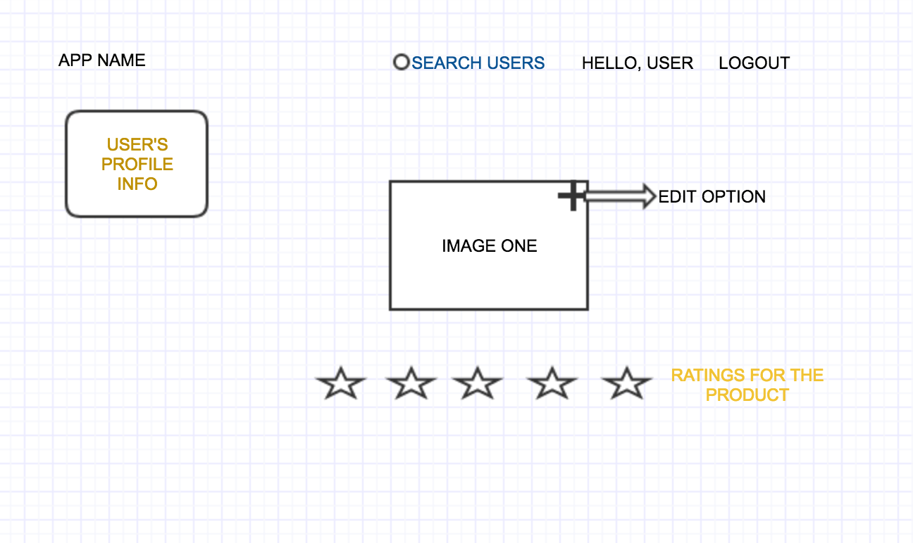
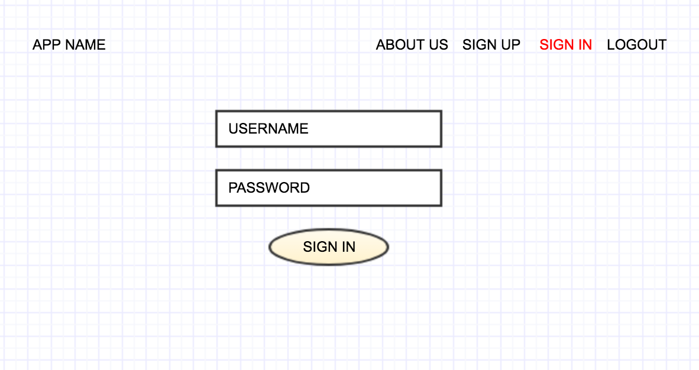
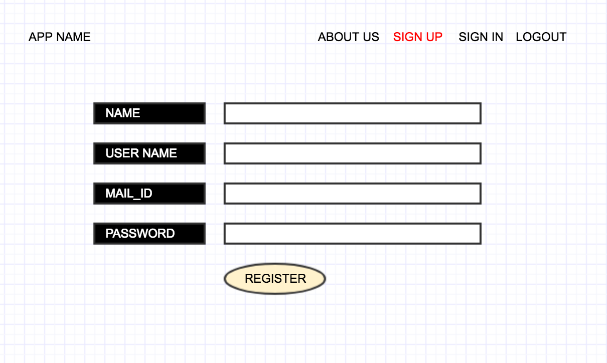

# PROJECT-4

## OVERVIEW

The basic concept of this app is to allow the user to upload a product's image and add review to it and like other's uploads! JUST LIKE INSTAGRAM!

## PROJECT DETAILS - FEATURES AND USER STORIES

### Necessary features
1. The user should be able to Sign up, Sign in and Logout.
2. The user must be able to add an image once he is logged into his profile.
3. The user must be able to give a rating to the image(i.e. the product) out of 5 adn like or dislike his image
4. The user can search for other users and look into what they have given reviews on a particular product.

### Advanced Features
1. The user must use hashtags to caption the product and when the user searches for that product in a search bar, it must show him the image and ratings of the recent uploads.
2. The user can follow other users.
3. Other user can comment on the any other user the current user follows to express his opinion of the product.
4. The user can share another user's image and rating to show on his profile.

### WireFrames

### GEMS used
1. Devise
2. Paperclip
3. Ransack

### GET STARTED
1. Fork and clone this repository.
2. Run 'bundle install' in command prompt.
3. Run 'rails server' in command prompt and get started!

### References
1. Stackoverflow
2. Rails guide.
3. Paperclip on github
4. acts_as_votable on github